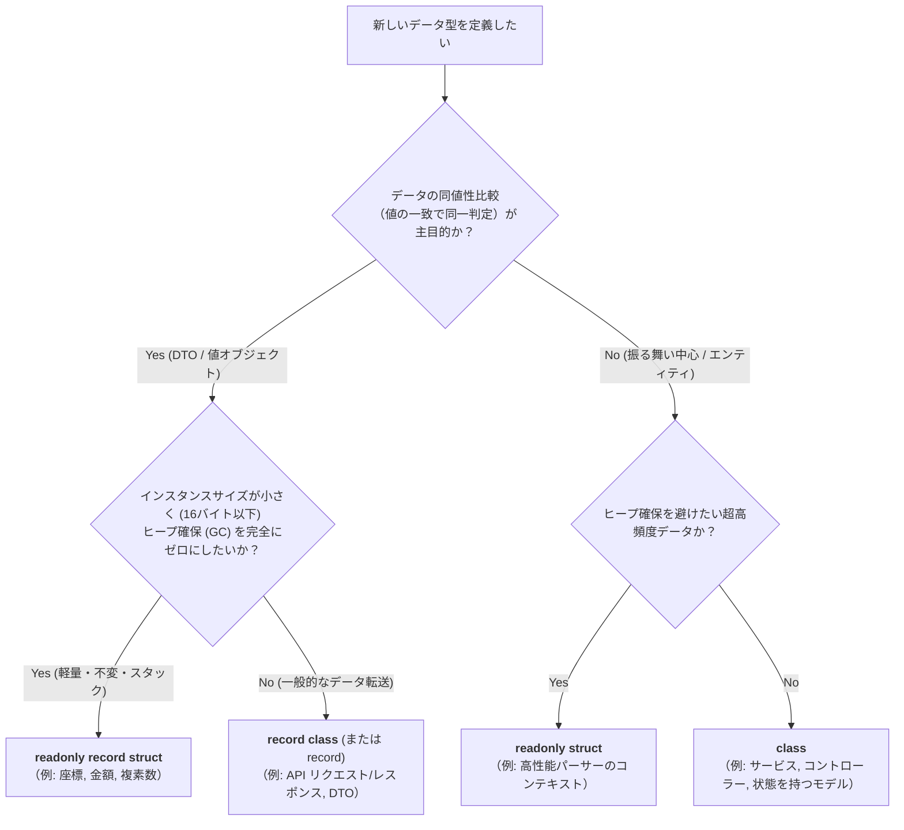
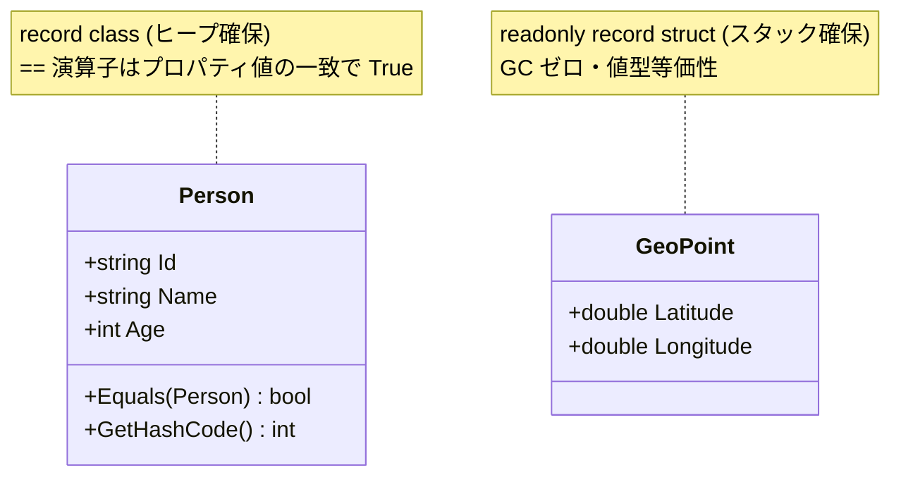
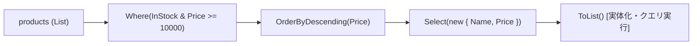
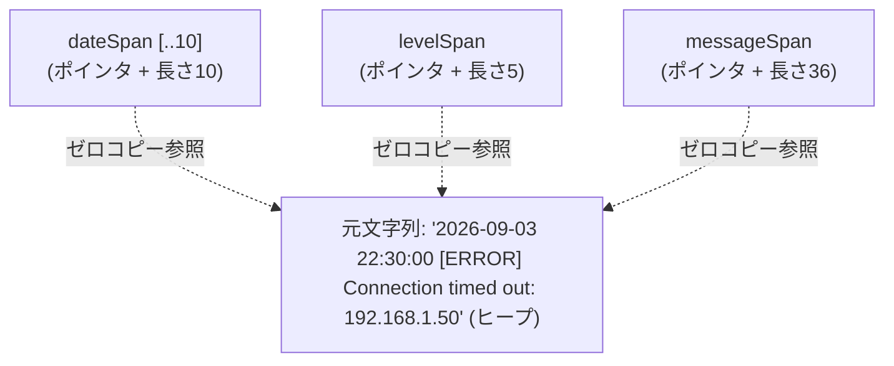
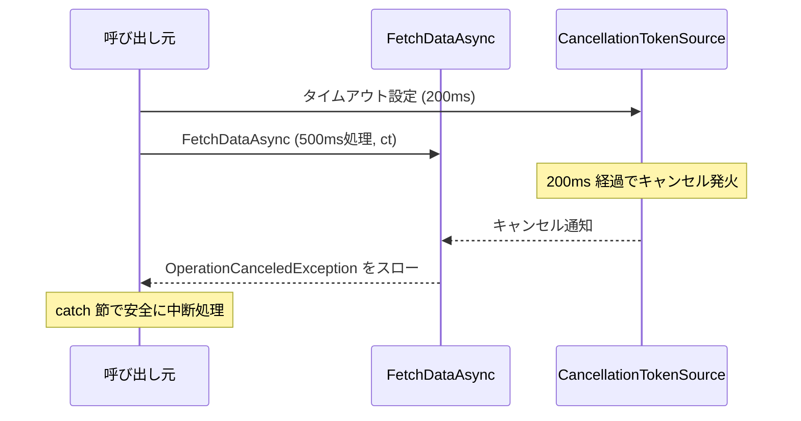
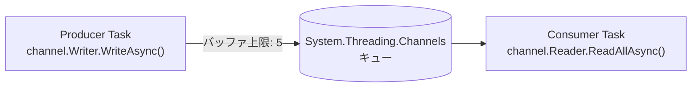
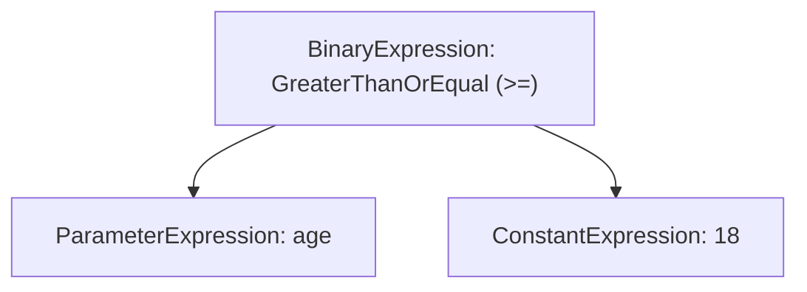
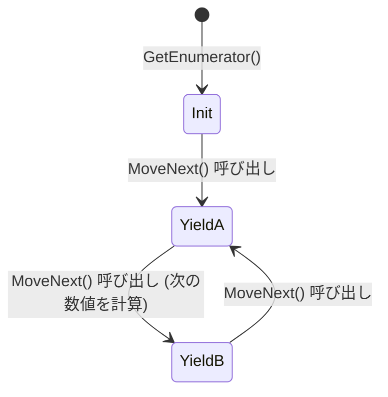

# Modern C# 実践完全解説ガイド (Crash Course All-in-One Master Guide)

本ドキュメントは、`C:\Users\harun\programming\c#\sample` に含まれるすべてのソースコード（モジュール 01〜07、`Program.cs`、`sample.csproj`）の内容、動作原理、実行結果、およびモダン C#（C# 12 / 13 on .NET 9）の言語仕様を、**これ 1 冊読めば網羅的かつ直感的にすべて理解できるように体系化した完全解説書**です。

Rust, Go, Python, Java, C++ などのバックグラウンドを持つエンジニアが、モダン C# のコア技術、パフォーマンス特性、および設計イディオムを最短で把握できるように、**豊富な図解（Mermaid）、Before/After 比較、メモリ構造、および実務での判断基準**を交えて解説しています。

---

## 📑 目次

1. [言語対比マッピング早見表 (C# vs 他言語)](#1-言語対比マッピング早見表-c-vs-他言語)
2. [他言語経験者がハマる C# 5大落とし穴とベストプラクティス](#2-他言語経験者がハマる-c-5大落とし穴とベストプラクティス)
3. [型の選択基準フローチャート (class vs struct vs record)](#3-型の選択基準フローチャート-class-vs-struct-vs-record)
4. [統合エントリーポイント: `Program.cs`](#4-統合エントリーポイント-programcs)
5. [モジュール 01: 基本型・レコード・モダン構文 (`01_BasicsAndTypes.cs`)](#5-モジュール-01-基本型レコードモダン構文-01_basicsandtypescs)
6. [モジュール 02: コレクション・LINQ・Span (`02_CollectionsAndLinq.cs`)](#6-モジュール-02-コレクションlinqspan-02_collectionsandlinqcs)
7. [モジュール 03: 非同期プログラミング & 並行処理 (`03_AsyncAndConcurrency.cs`)](#7-モジュール-03-非同期プログラミング--並行処理-03_asyncandconcurrencycs)
8. [モジュール 04: 例外処理・リソース管理 (`04_ExceptionAndResource.cs`)](#8-モジュール-04-例外処理リソース管理-04_exceptionandresourcecs)
9. [モジュール 05: ラムダ式・デリゲート・式ツリー (`05_LambdasAndDelegates.cs`)](#9-モジュール-05-ラムダ式デリゲート式ツリー-05_lambdasanddelegatescs)
10. [モジュール 06: ジェネリクス・インターフェース・モダン型システム (`06_GenericsAndInterfaces.cs`)](#10-モジュール-06-ジェネリクスインターフェースモダン型システム-06_genericsandinterfacescs)
11. [モジュール 07: 高度な言語機能・イテレータ・拡張メソッド (`07_AdvancedLanguageFeatures.cs`)](#11-モジュール-07-高度な言語機能イテレータ拡張メソッド-07_advancedlanguagefeaturescs)
12. [プロジェクト設定 (`sample.csproj`) と関連ガイド](#12-プロジェクト設定-samplecsproj-と関連ガイド)

---

## 1. 言語対比マッピング早見表 (C# vs 他言語)

C# の各機能が、他言語（Rust, Go, Java, Python）のどの概念に相当するかを整理した対応表です。

| 概念・機能 | Modern C# (12 / 13) | Rust | Go | Java (21+) | Python (3.10+) |
| :--- | :--- | :--- | :--- | :--- | :--- |
| **ローカル型推論** | `var x = 10;` | `let x = 10;` | `x := 10` | `var x = 10;` | `x = 10` |
| **不変データ構造** | `record User(...)` | `struct User` | `type User struct` | `record User(...)` | `@dataclass(frozen=True)` |
| **スタック値型** | `struct` / `record struct` | `struct` (値型) | `struct` (値型) | ❌ (ヒープ参照のみ) | ❌ (ヒープ参照のみ) |
| **ゼロコピー切り出し** | `Span<T>` / `ReadOnlySpan<T>` | `&[T]` / `&str` | `slice [a:b]` | ❌ (配列コピー発生) | `memoryview` / slice |
| **値の同値性比較** | `==` (オーバーロード可) | `==` (`PartialEq`) | `==` | `a.equals(b)` | `==` (`__eq__`) |
| **参照の一致比較** | `ReferenceEquals(a, b)` | `std::ptr::eq` | ポインタ比較 | `a == b` | `a is b` |
| **パターンマッチング** | switch 式 / プロパティ / リスト | `match` 式 | type switch | switch パターン | `match ... case` |
| **コレクション操作** | **LINQ** (`Where`, `Select`) | `.iter().filter().map()` | slices / ループ | Stream API | 内包表記 / `filter` |
| **Null 安全性** | `string?` (NRT) | `Option<T>` | `*string` / `nil` | `Optional<T>` | `str \| None` |
| **リソース自動解放** | `using var r = ...` | `Drop` トレイト | `defer r.Close()` | `try (var r = ...)` | `with r:` |
| **非同期 Promise** | `Task<T>` / `ValueTask<T>` | `Future<T>` (tokio) | goroutine + channel | `CompletableFuture` | `asyncio.Task` |
| **並行パイプライン** | `System.Threading.Channels` | `tokio::sync::mpsc` | **channel** (`chan T`) | `BlockingQueue` | `asyncio.Queue` |

---

## 2. 他言語経験者がハマる C# 5大落とし穴とベストプラクティス

### ① `record` のコレクションプロパティ等価性の罠
- **現象**: `record` は自動生成される `Equals` で全フィールドの同値性を比較しますが、**`string[]` や `List<T>` などのコレクション型プロパティは「参照比較（同一インスタンスか）」** になります。要素が完全に同一でも `u1 == u2` は `false` になります。
- **理由**: C# の配列や `List<T>` は `IEquatable<T>` を実装しておらず、`Equals()` がインスタンスのメモリアドレス比較（`ReferenceEquals`）を行うためです。
- **対策**: 配列やリストを含む record の等価性を担保したい場合は、カスタム `Equals` を書くか `StructuralComparisons.StructuralEqualityComparer` を使用します。

### ② `async void` は絶対に書いてはいけない
- **現象**: `async void` は GUI のボタンクリックなどのイベントハンドラ用に作られた例外的な構文です。通常のコードで使うと、**内部で発生した例外が呼び出し元の `try-catch` で捕捉できず、プロセス全体（スレッドプール）が即座にクラッシュ**します。
- **対策**: 戻り値のない非同期メソッドは、必ず `async Task` と宣言してください。

### ③ `IEnumerable<T>` の二重評価 (Multiple Enumeration)
- **現象**: LINQ のメソッド（`Where`, `Select` など）は**遅延評価（Deferred Execution）**です。クエリ結果の変数を複数回 `foreach` で走査したり、`.Any()` の直後に `.Count()` を呼ぶと、背後のフィルタ計算や DB クエリが複数回実行されます。
- **対策**: 結果を複数回参照・再利用する場合は、必ず末尾で `.ToList()` や `.ToArray()` を呼び出してメモリ上に実体化（Materialize）してください。

### ④ `Span<T>` の制約 (`ref struct` の生存期間ルール)
- **現象**: `Span<T>` はスタック上にしか存在できない `ref struct` です。ヒープ領域への脱出が禁じられているため、**通常のクラスのフィールドに保持すること、`async` メソッドの `await` をまたぐこと、object にボックス化することはコンパイルエラー**になります。
- **対策**: 非同期処理をまたいでメモリを参照したい場合や、クラスのフィールドとして保持したい場合は、ヒープ対応の `Memory<T>` / `ReadOnlyMemory<T>` を使用します。

### ⑤ 構造体（`struct`）の暗黙コピーと防御的コピー
- **現象**: C# の `struct` は値型であり、代入や引数渡しのたびに全バイトがメモリコピーされます。また、`readonly` ではない struct に対して読み取り専用プロパティを呼ぶと、コンパイラが「内部状態が書き換わるかもしれない」と判断し、内部で**「防御的コピー（Defensive Copy）」**を自動生成して性能を著しく悪化させます。
- **対策**: 変更不要な構造体は必ず `readonly struct` または `readonly record struct` として宣言し、引数には `in` 修飾子を使用します。

---

## 3. 型の選択基準フローチャート (class vs struct vs record)

C# においてどの型宣言を選ぶべきかの実践的な判断基準です。



---

## 4. 統合エントリーポイント: `Program.cs`

### 概要
C# 9+ の**トップレベルステートメント**を採用しています。従来の `class Program { static async Task Main(string[] args) { ... } }` という冗長なボイラープレートなしで、スクリプトのように直感的に記述できます。

### 実行順序とアーキテクチャ
全モジュールは依存関係を持たず、順次実行されます。非同期メソッド（`RunAsync`）は `await` で呼び出され、完了を待機します。

```mermaid
flowchart LR
    Start(["Program.cs (Start)"]) --> M1["01: BasicsAndTypes.Run()"]
    M1 --> M2["02: CollectionsAndLinq.Run()"]
    M2 --> M3["03: AsyncAndConcurrency.RunAsync()"]
    M3 --> M4["04: ExceptionAndResource.RunAsync()"]
    M4 --> M5["05: LambdasAndDelegates.Run()"]
    M5 --> M6["06: GenericsAndInterfaces.Run()"]
    M6 --> M7["07: AdvancedLanguageFeatures.Run()"]
    M7 --> Done(["All Completed (Exit Code 0)"])
```



### ソースコード抜粋
```csharp
using Sample;

PrintBanner("MODERN C# CRASH COURSE (Running on .NET " + Environment.Version + ")");

// 各モジュールを順次実行
BasicsAndTypes.Run();
CollectionsAndLinq.Run();
await AsyncAndConcurrency.RunAsync();
await ExceptionAndResource.RunAsync();
LambdasAndDelegates.Run();
GenericsAndInterfaces.Run();
AdvancedLanguageFeatures.Run();

PrintBanner("ALL C# TUTORIAL MODULES COMPLETED SUCCESSFULLY!");
```

---

## 5. モジュール 01: 基本型・レコード・モダン構文 (`01_BasicsAndTypes.cs`)

### 5-1. `record class` vs `record struct`（値の等価性と非破壊的更新）

C# の `record` は、イミュータブルなデータモデリングを劇的にシンプルにします。



- **値ベースの等価性**: 通常の `class` では `==` はメモリアドレスの比較になりますが、`record` ではコンパイラがすべてのプロパティを比較する `Equals` と `==` を自動生成します。
- **非破壊的更新 (`with` 式)**: 既存のオブジェクトを変更せず、一部のプロパティだけを更新した新しいインスタンスを作成します。

```csharp
public record Person(string Id, string Name, int Age);
public readonly record struct GeoPoint(double Latitude, double Longitude);

var p1 = new Person("p101", "Alice", 28);
var p2 = new Person("p101", "Alice", 28);

// 値ベース比較なので True になる
Console.WriteLine(p1 == p2);                  // True
Console.WriteLine(ReferenceEquals(p1, p2));   // False (参照アドレスは別)

// 'with' 式による安全なコピー更新
var p3 = p1 with { Age = 29 };
```

> ⚠️ **コレクションを含む record の落とし穴**:  
> `record User(string Id, string[] Roles)` のように配列や `List` をプロパティに持つと、配列の `Equals` は参照比較になるため、要素が同じでも `u1 == u2` が `false` になります。

---

### 5-2. プライマリコンストラクタ (C# 12) & `required` / `init` (C# 11)

#### プライマリコンストラクタの Before / After
従来の C# ではコンストラクタ引数をプライベートフィールドに代入する記述が必要でしたが、C# 12 ではクラス宣言に直接引数を定義できます。

```csharp
// 【After: C# 12 プライマリコンストラクタ】 わずか 4 行で完結
public class ServiceEndpoint(string host, int port)
{
    public string Url => $"https://{host}:{port}";
}
```

#### `required` プロパティと `init` 専用セッター
オブジェクト初期化時に「必ず設定しなければならないプロパティ」をコンパイル時に強制します。`init` により、初期化後は読み取り専用になります。

```csharp
public class OrderRequest
{
    public required string OrderId { get; init; }
    public required decimal TotalAmount { get; init; }
    public string Note { get; init; } = string.Empty;
}

// 正常な初期化 (OrderId と TotalAmount の指定が必須)
var order = new OrderRequest
{
    OrderId = "ORD-2026-999",
    TotalAmount = 4500m
};
// order.TotalAmount = 5000m; // ❌ コンパイルエラー (init 専用のため変更不可)
```

---

### 5-3. パターンマッチング (Switch 式・プロパティ・関係パターン)

switch 文ではなく **switch 式** を使用することで、値を返す式としてパターンマッチを行えます。

```csharp
public abstract record PaymentMethod;
public record CreditCard(string CardNumber, string HolderName, decimal Balance) : PaymentMethod;
public record CryptoTransfer(string WalletAddress, string Network) : PaymentMethod;
public record BankAccount(string Iban, string BankName) : PaymentMethod;

string result = payment switch
{
    // プロパティパターン + 関係パターン (Balance >= 10000)
    CreditCard { Balance: >= 10000m } c => $"CreditCard Approved (High Balance: {c.Balance:C})",
    CreditCard c => $"CreditCard Approved (Normal: {c.Balance:C})",
    CryptoTransfer { Network: "Ethereum" } eth => $"Crypto ETH to {eth.WalletAddress}",
    CryptoTransfer crypto => $"Other Crypto ({crypto.Network}) to {crypto.WalletAddress}",
    BankAccount bank => $"Bank transfer via {bank.BankName}",
    null => "Payment method is null",
    _ => "Unknown payment method"
};

// 数値の範囲判定 (関係パターン)
string weather = temperature switch
{
    < 0 => "Freezing",
    >= 0 and < 15 => "Cold",
    >= 15 and < 28 => "Pleasant",
    _ => "Hot"
};
```

---

### 5-4. インデックス (`^`)・範囲 (`..`)・リストパターン

Python の負のインデックスやスライスに匹敵する直感的な配列操作です。

```csharp
string[] words = ["zero", "one", "two", "three", "four", "five"];

string last = words[^1];        // 末尾から1番目 ("five")
string secondLast = words[^2];  // 末尾から2番目 ("four")
string[] slice = words[1..^1];  // 1番目から末尾の1つ前まで ["one", "two", "three", "four"]

// C# 11 リストパターンによる配列の構造分解マッチ
int[] numbers = [10, 20, 30, 40, 50];
string analysis = numbers switch
{
    [var first, .., var lastNum] => $"Starts with {first} and ends with {lastNum}",
    [var single] => $"Single element: {single}",
    [] => "Empty list",
    _ => "Other pattern"
};
```

---

### 5-5. 生文字列リテラル (Raw String Literals: C# 11)

ダブルクォーテーション 3 つ（`"""`）で囲むことで、エスケープシーケンスが不要になります。さらに `$$"""` と記述すると、波括弧 2 つ（`{{...}}`）だけを変数展開とし、1 つの `{}` はそのまま JSON 記号として記述できます。

```csharp
string author = "Harun";
int year = 2026;

string json = $$"""
{
    "title": "Modern C# Guide",
    "author": "{{author}}",
    "year": {{year}},
    "features": ["Records", "Pattern Matching", "Raw Strings"]
}
""";
```

---

### 5-6. Null 許容参照型 (Nullable Reference Types: NRT)

`<Nullable>enable</Nullable>` により、型システムが null を厳密に検査します。
- `string`: null を許容しない（null を代入すると警告）
- `string?`: null を許容する
- `??=`: null の場合のみ代入（null 合体代入）
- `?.`: null 条件演算子（null の場合は後続を評価せず null を返す）
- `??`: null 合体演算子（null の場合のデフォルト値を指定）

### 実行結果 (モジュール 01)
```text
=== 1. Records & Value-based Equality ===
p1 == p2 (Record Value Equality): True
ReferenceEquals(p1, p2):          False
Original p1 Age: 28, Cloned p3 Age: 29
u1 == u2 (Collection property trap): False (Array uses ReferenceEquals!)
GeoPoint (Record Struct): 35.6812, 139.7671

=== 2. Primary Constructors (C# 12) & Required Properties (C# 11) ===
Endpoint URL: https://api.example.com:443
Order: ORD-2026-999, Amount: ¥4,500

=== 3. Modern Pattern Matching (Switch Expressions) ===
Payment Status: CreditCard Approved (High Balance: ¥15,000)
Temperature 25C is: Pleasant

=== 4. Index (^), Range (..), and List Patterns ===
First: zero, Last (^1): five, Second to last (^2): four
Slice [1..^1]: [one, two, three, four]
List pattern analysis: Starts with 10 and ends with 50

=== 5. Raw String Literals (C# 11: """ ... """) ===
{
    "title": "Modern C# Guide",
    "author": "Harun",
    "year": 2026,
    "features": ["Records", "Pattern Matching", "Raw Strings"]
}

=== 6. Nullable Reference Types (NRT) ===
Resolved Name: Default Guest
Display Email: no-email@domain.com
```

---

## 6. モジュール 02: コレクション・LINQ・Span (`02_CollectionsAndLinq.cs`)

### 6-1. LINQ パイプラインと遅延評価 (Deferred Execution)

LINQ はデータ処理のパイプラインを宣言的に構築します。



```csharp
var premiumInStock = products
    .Where(p => p.InStock && p.Price >= 10000m)
    .OrderByDescending(p => p.Price)
    .Select(p => new { p.Name, p.Price })
    .ToList(); // 走査して結果をメモリに確定

// GroupBy によるカテゴリ集計
var categoryStats = products
    .GroupBy(p => p.Category)
    .Select(g => new
    {
        Category = g.Key,
        Count = g.Count(),
        AvgPrice = g.Average(p => p.Price),
        TotalValue = g.Where(p => p.InStock).Sum(p => p.Price)
    });

// .NET 6+ の便利メソッド: Chunk (バッチ分割)
int[] ids = [1, 2, 3, 4, 5];
var batches = ids.Chunk(2); // [[1, 2], [3, 4], [5]]
```

---

### 6-2. コレクション式とスプレッド演算子 `..` (C# 12)

配列、`List<T>`、`HashSet<T>`、`ImmutableArray<T>`、`Span<T>` のすべてを統一記法 `[...]` で初期化できます。スプレッド演算子 `..` により、既存のコレクションを直感的に合成できます。

```csharp
int[] front = [1, 2];
int[] back = [4, 5];

// スプレッド演算子 '..' で結合
int[] combined = [.. front, 3, .. back]; // [1, 2, 3, 4, 5]

// 不変配列も同一の記法で初期化可能
ImmutableArray<string> immutableNames = ["Alpha", "Beta", "Gamma"];
```

---

### 6-3. `Span<T>` & `ReadOnlySpan<T>` (ゼロアロケーション文字列解析)

文字列から一部を抽出する際、従来の `Substring()` は新しい文字列オブジェクトをヒープに確保（アロケーション）していましたが、`ReadOnlySpan<char>` は元のメモリ領域への「参照ポインタ＋長さ」だけで表現されるため、**メモリ割り当てが完全に 0** になります。



```csharp
string logLine = "2026-09-03 22:30:00 [ERROR] Connection timed out: 192.168.1.50";
ReadOnlySpan<char> span = logLine.AsSpan();

// ヒープ確保なしでスライス
ReadOnlySpan<char> dateSpan = span[..10];
int openBracket = span.IndexOf('[');
int closeBracket = span.IndexOf(']');
ReadOnlySpan<char> levelSpan = span.Slice(openBracket + 1, closeBracket - openBracket - 1);
ReadOnlySpan<char> messageSpan = span[(closeBracket + 2)..];
```

---

### 6-4. `stackalloc` によるスタック直接確保

ヒープメモリ（GC）を完全にバイパスし、CPU スタックフレームに直接メモリを確保します。C 言語の `alloca` と同等のパフォーマンスを、C# のメモリ安全性のもとで実現します。

```csharp
// スタックに直接 128 バイトを確保 (unsafe 不要)
Span<byte> buffer = stackalloc byte[128];
buffer[0] = 0xAA;
buffer[1] = 0xBB;
```

---

### 6-5. .NET 8 `FrozenDictionary` / `FrozenSet`

起動時に構築され、以降は読み取り専用となるマスタデータや設定値に特化したコレクションです。通常の `Dictionary` よりもハッシュテーブルの探索が極限まで高速化されています。

```csharp
var pairs = new Dictionary<string, int> { ["USD"] = 150, ["EUR"] = 165 };
FrozenDictionary<string, int> rates = pairs.ToFrozenDictionary();
```

### 実行結果 (モジュール 02)
```text
=== 1. LINQ (Query Pipeline / Deferred Execution) ===
Premium In-Stock Products:
  * MacBook Pro (¥250,000)
  * Mechanical Keyboard (¥18,000)

Category Aggregation:
  [Electronics] Count: 3, AvgPrice: ¥101,000, TotalInStock: ¥268,000
  [Books] Count: 2, AvgPrice: ¥4,000, TotalInStock: ¥8,000
  [Misc] Count: 1, AvgPrice: ¥1,500, TotalInStock: ¥1,500
Chunked batches count: 3 (e.g. first batch size: 2)

=== 2. Collection Expressions & Spread (..) (C# 12) ===
Combined via spread: [1, 2, 3, 4, 5]
ImmutableArray count: 3

=== 3. Span<T> & ReadOnlySpan<T> (Zero-Allocation) ===
Extracted Date:    2026-09-03
Extracted Level:   ERROR
Extracted Message: Connection timed out: 192.168.1.50
  -> No new string allocations occurred during slicing!

=== 4. stackalloc with Span<byte> (Bypassing Heap/GC) ===
Allocated stack buffer length: 128 bytes, First bytes: 0xAA 0xBB

=== 5. .NET 8 Frozen Collections (Optimized Read-Only) ===
Frozen rate for USD: JPY 150
```

---

## 7. モジュール 03: 非同期プログラミング & 並行処理 (`03_AsyncAndConcurrency.cs`)

### 7-1. `async / await` と `CancellationToken`

C# の非同期処理はスレッドをブロックせず、I/O 完了時に継続処理（コールバック）を実行します。キャンセレーションは協調的（Cooperative）に行われます。



```csharp
using var cts = new CancellationTokenSource(TimeSpan.FromMilliseconds(200));

try
{
    string res = await FetchDataAsync("Service-B", 500, cts.Token);
}
catch (OperationCanceledException)
{
    Console.WriteLine("タイムアウトによりキャンセルされました");
}
```

---

### 7-2. `IAsyncEnumerable<T>` と `await foreach` (非同期ストリーミング)

生成側は `yield return` と `await` を組み合わせ、消費側は `await foreach` で 1 件ずつストリーミング処理します。LLM のトークンストリーミングや gRPC サーバーストリ―ミングに必須の技術です。

```csharp
// 非同期ジェネレータ
private static async IAsyncEnumerable<int> GenerateNumbersAsync(
    int count,
    int delayMs,
    [EnumeratorCancellation] CancellationToken ct = default)
{
    for (int i = 1; i <= count; i++)
    {
        await Task.Delay(delayMs, ct);
        yield return i * 10;
    }
}

// 消費側
await foreach (int number in GenerateNumbersAsync(3, 20))
{
    Console.WriteLine($"Received: {number}");
}
```

---

### 7-3. `Parallel.ForEachAsync` (.NET 6+)

大量のタスクを並行処理する際、`MaxDegreeOfParallelism` で同時実行スレッド/タスク数を厳密に絞り込み、サーバーリソースの枯渇を防ぎます。

```csharp
var options = new ParallelOptions { MaxDegreeOfParallelism = 3 };

await Parallel.ForEachAsync(items, options, async (item, ct) =>
{
    await Task.Delay(30, ct); // 非同期 I/O
});
```

---

### 7-4. `System.Threading.Channels` (Go 言語相当の Channel)

Go 言語の `chan T` と同等の、スレッドセーフで高性能な非同期メッセージキューです。



```csharp
var channel = Channel.CreateBounded<string>(5);

// Producer
var producer = Task.Run(async () =>
{
    for (int i = 1; i <= 3; i++)
    {
        await channel.Writer.WriteAsync($"Message #{i}");
    }
    channel.Writer.Complete(); // 送信完了通知
});

// Consumer
var consumer = Task.Run(async () =>
{
    await foreach (string message in channel.Reader.ReadAllAsync())
    {
        Console.WriteLine($"Received: {message}");
    }
});

await Task.WhenAll(producer, consumer);
```

---

### 7-5. 新型 `System.Threading.Lock` (.NET 9 / C# 13)

従来の `lock (new object())` に代わる、専用の軽量ロック型です。型安全であり、内部構造が最適化されています。

```csharp
private static readonly Lock SyncLock = new();

lock (SyncLock)
{
    SharedCounter++;
}
```

### 実行結果 (モジュール 03)
```text
=== 1. async/await & CancellationToken ===
Result 1: Service-A Data (waited 50ms)
Starting slow task (will be cancelled)...
  -> Successfully caught OperationCanceledException (Timeout)!

=== 2. IAsyncEnumerable<T> & await foreach (Streaming) ===
  [Stream Item Received]: 10
  [Stream Item Received]: 20
  [Stream Item Received]: 30

=== 3. Parallel.ForEachAsync (Controlled Concurrency) ===
Processed 6 items in parallel (76ms)

=== 4. System.Threading.Channels (Go-like Channel) ===
  [Consumer received]: Message #1
  [Consumer received]: Message #2
  [Consumer received]: Message #3

=== 5. System.Threading.Lock (.NET 9 / C# 13) ===
Thread-safe counter value under Lock: 1
```

---

## 8. モジュール 04: 例外処理・リソース管理 (`04_ExceptionAndResource.cs`)

### 8-1. `using` 宣言による RAII 自動リソース解放 (`IDisposable`)

C# 8 から、中括弧 `{}` を書かずに `using var` と宣言するだけで、その変数が属するスコープを抜けた瞬間に自動で `Dispose()` が呼ばれます（Rust の `Drop` や C++ の RAII と同等）。

```csharp
private static void DemoUsingDeclaration()
{
    // メソッド終了時に自動的に session.Dispose() が呼ばれる
    using var session = new DatabaseSession("conn-sync-999");
    session.Query("SELECT * FROM users");
    Console.WriteLine("Exiting DemoUsingDeclaration scope...");
}
```

---

### 8-2. `await using` 宣言 (`IAsyncDisposable`)

ネットワークソケットやファイルバッファのフラッシュなど、非同期でクリーンアップを行う必要があるリソースのための構文です。

```csharp
await using var session = new DatabaseSession("conn-async-123");
session.Query("INSERT INTO audit_logs VALUES ('action')");
```

---

### 8-3. 例外フィルター (`catch ... when ...`)

`catch (Exception ex) when (条件)` は、**「スタックを巻き戻す前」**に条件を評価します。条件を満たさない例外は catch 節に入らずそのまま上位へ抜けるため、デバッグ時にスタックトレースが保持される大きなメリットがあります。

```csharp
try
{
    throw new BusinessRuleException("ERR_INSUFFICIENT_FUNDS", "Account balance is negative");
}
catch (BusinessRuleException ex) when (ex.Code == "ERR_INSUFFICIENT_FUNDS")
{
    // 特定の業務エラーコードの場合のみ捕捉
    Console.WriteLine($"Filtered Catch: {ex.Message}");
}
```

---

### 8-4. ガード節と `[CallerArgumentExpression]` (C# 10)

`ArgumentNullException.ThrowIfNull(arg)` は 1 行で null 検証を行えます。
`[CallerArgumentExpression]` 属性を使うと、呼び出し元で記述された式（変数名など）がコンパイル時に文字列として自動注入されます。

```csharp
// 自作バリデータでの応用
private static void EnsureNotNull<T>(
    T? value,
    [CallerArgumentExpression(nameof(value))] string? expr = null) where T : class
{
    if (value is null)
    {
        // expr には呼び出し元で書いた変数名 "validUser" 等が自動で入る
        throw new ArgumentNullException(expr, $"Expression '{expr}' evaluated to null.");
    }
}
```

### 実行結果 (モジュール 04)
```text
=== 1. 'using' Declaration (Auto-Dispose / RAII) ===
  [DB] Session opened: conn-sync-999
  [DB] Executing: SELECT * FROM users (conn-sync-999)
Exiting DemoUsingDeclaration scope...
  [DB] Session disposed (Cleaned up): conn-sync-999

=== 2. 'await using' Declaration (IAsyncDisposable) ===
  [DB] Session opened: conn-async-123
  [DB] Executing: INSERT INTO audit_logs VALUES ('action') (conn-async-123)
Exiting DemoAsyncUsingDeclaration scope...
  [DB] Session disposed (Cleaned up): conn-async-123

=== 3. Exception Filters ('catch ... when ...') ===
  [Filtered Catch]: Handled code 'ERR_INSUFFICIENT_FUNDS': Account balance is negative

=== 4. Modern Guard Clauses & CallerArgumentExpression (C# 10+) ===
Validated argument successfully: Alice
  -> Caught expected ThrowIfNull: ParamName='invalidInput'
```

---

## 9. モジュール 05: ラムダ式・デリゲート・式ツリー (`05_LambdasAndDelegates.cs`)

> 📖 **より深い内部構造（コンパイラが裏で生成するクラスや IL コードなど）は [`LAMBDA.md`](./LAMBDA.md) に完全解説されています。**

### 9-1. 標準デリゲート (`Func`, `Action`) と自然な型推論
- `Func<T1, T2, TResult>`: 引数を受け取り、結果を返す関数
- `Action<T1, T2>`: 引数を受け取り、何も返さない（void）関数
- **自然な型推論 (C# 10)**: `var multiply = (int x, int y) => x * y;` のように `var` でラムダを受け取れます。

---

### 9-2. クロージャと静的ラムダ (`static lambda`: C# 9)

外部変数をキャプチャすると、コンパイラは内部で隠しクラス（`<>c__DisplayClass`）をヒープに割り当てます。
**`static` ラムダ** を宣言すると、外部変数のキャプチャが禁止され、**GC アロケーションが完全にゼロ**であることがコンパイル時に保証されます。

```csharp
int threshold = 50;

// 通常のラムダ: threshold をキャプチャ (ヒープアロケーション発生)
Func<int, bool> isAbove = x => x > threshold;

// 静的ラムダ: 外部変数キャプチャを禁止 (GC アロケーション完全ゼロ)
Func<int, int, int> maxFunc = static (a, b) => Math.Max(a, b);
```

---

### 9-3. ローカル関数 vs ラムダ式

メソッド内に定義するローカル関数は、デリゲートオブジェクト（ヒープ）を生成せず、コンパイラによって直接インライン化されやすいため、ラムダ式よりも高性能です。

```csharp
static int Factorial(int n)
{
    return n <= 1 ? 1 : n * Factorial(n - 1);
}
```

---

### 9-4. 式ツリー (Expression Trees: AST)

ラムダ式を `Expression<Func<int, bool>>` として宣言すると、実行コードではなく**抽象構文木（AST: Abstract Syntax Tree）**として取得できます。Entity Framework Core が C# のコードを解析して SQL を生成できるコア技術です。



```csharp
Expression<Func<int, bool>> isAdultExpr = age => age >= 18;

Console.WriteLine(isAdultExpr.Body);           // (age >= 18)
Console.WriteLine(isAdultExpr.Body.NodeType);   // GreaterThanOrEqual

// 式ツリーを実行可能コードに動的コンパイルして動かすことも可能
Func<int, bool> compiled = isAdultExpr.Compile();
bool isAdult = compiled(20); // True
```

### 実行結果 (モジュール 05)
```text
=== 1. Built-in Delegates (Func, Action) & Natural Types ===
Func add(10, 20): 30
  [LOG]: Standard Action executed
Natural type lambda multiply(4, 5): 20

=== 2. Closures & C# 9 Static Lambdas ===
Is 70 above 50? True
Static lambda max(15, 25): 25

=== 3. Local Functions vs Lambdas ===
Local function Factorial(5): 120

=== 4. Expression Trees (AST / LINQ to SQL Mechanism) ===
Expression Body:       (age >= 18)
Expression NodeType:   GreaterThanOrEqual
Expression Parameter:  age
  Left operand:  age
  Right operand: 18
Compiled AST result for age 20: True
```

---

## 10. モジュール 06: ジェネリクス・インターフェース・モダン型システム (`06_GenericsAndInterfaces.cs`)

### 10-1. 静的抽象メンバ (Static Abstract Members: C# 11) & Generic Math

C# 11 で導入された最も強力な型システム拡張です。インターフェース内に `static abstract` なメソッドや演算子（`+`, `-` など）を宣言できるようになりました。

`INumber<T>` を使うことで、`int` や `double` などの異なる数値型に対して、**完全に同一のロジックで動作する汎用計算関数**をオーバーヘッドなしで記述できます（Rust のトレイト制約と同等）。

```csharp
// int でも double でも同じ合計関数が動作する
private static T SumAll<T>(ReadOnlySpan<T> numbers) where T : INumber<T>
{
    T total = T.Zero; // 型パラメータ T の静的プロパティ Zero
    foreach (T n in numbers)
    {
        total += n;   // 型パラメータ T の静的 + 演算子
    }
    return total;
}
```

---

### 10-2. デフォルトインターフェースメソッド (DIM: C# 8)

インターフェースに標準実装を持たせることで、ライブラリ公開後に新メソッドを追加しても、既存の実装クラスを壊さずに機能拡張できます。

```csharp
public interface ILogger
{
    void Log(string message);
    // デフォルト実装
    void LogError(string error) => Log($"[ERROR] {error}");
}
```

---

### 10-3. 静的抽象ファクトリパターン (`IFactory<TSelf>`)

「インスタンスを作らずに、型パラメータから直接デフォルト値を生成する」ファクトリメソッドを強制できます。

```csharp
public interface IFactory<TSelf> where TSelf : IFactory<TSelf>
{
    static abstract TSelf CreateDefault();
}

public record AppConfig(string AppName, int TimeoutSeconds) : IFactory<AppConfig>
{
    public static AppConfig CreateDefault() => new("DefaultApplication", 30);
}

// 型引数 T から直接生成
private static T InstantiateDefault<T>() where T : IFactory<T> => T.CreateDefault();
```

---

### 10-4. 明示的インターフェース実装 (Explicit Implementation)

2 つのインターフェースが同名のメソッドを持っている場合に、実装を完全に切り分けられます。

```csharp
public class DocumentProcessor : IOrderReader, IInvoiceReader
{
    void IOrderReader.Read() => Console.WriteLine("Order を読み取り");
    void IInvoiceReader.Read() => Console.WriteLine("Invoice を読み取り");
}
```

### 実行結果 (モジュール 06)
```text
=== 1. Generic Math via Static Abstract Members (C# 11) ===
Generic Math Sum (int):    100
Generic Math Sum (double): 7.5

=== 2. Default Interface Methods (DIM - C# 8) ===
ConsoleLogger: Normal notification
ConsoleLogger: [ERROR] Database connection failed!

=== 3. Static Abstract Members & Factory Pattern ===
Created default config: DefaultApplication (Timeout: 30s)

=== 4. Explicit Interface Implementation ===
  Reading Order document...
  Reading Invoice document...

=== 5. Generic Constraints (where T : class, new()) ===
Container created item with default host: localhost
```

---

## 11. モジュール 07: 高度な言語機能・イテレータ・拡張メソッド (`07_AdvancedLanguageFeatures.cs`)

### 11-1. `yield return` による遅延イテレータ

メソッド内で `yield return` を使うと、コンパイラが自動的にステートマシン（状態遷移クラス）を生成します。シーケンス全体をメモリに保持せず、要求された分だけをオンデマンドで生成するため、**無限数列（フィボナッチ数列など）でもメモリ消費量 O(1) で処理**できます。



```csharp
private static IEnumerable<int> GenerateFibonacci()
{
    int a = 0, b = 1;
    while (true)
    {
        yield return a;
        int next = a + b;
        a = b;
        b = next;
    }
}

// 最初の 7 つだけオンデマンドで取得
var fibonacci = GenerateFibonacci().Take(7); // [0, 1, 1, 2, 3, 5, 8]
```

---

### 11-2. 拡張メソッド (Extension Methods)

既存の型に、あたかもインスタンスメソッドが生えているかのように新しいメソッドを追加できます。

```csharp
public static class CustomExtensions
{
    // string 型に ToTitleCase メソッドを追加
    public static string ToTitleCase(this string s) { ... }

    // ジェネリック型に IsBetween メソッドを追加
    public static bool IsBetween<T>(this T value, T min, T max) where T : IComparable<T>
    {
        return value.CompareTo(min) >= 0 && value.CompareTo(max) <= 0;
    }
}

// 呼び出し側
string title = "hello modern csharp".ToTitleCase();
bool ok = 42.IsBetween(10, 50); // True
```

---

### 11-3. 演算子オーバーロード & 暗黙の型変換 (`implicit operator`)

ドメイン駆動設計（DDD）における「値オブジェクト（Value Object）」を美しく設計できます。

```csharp
public readonly record struct Money(decimal Amount, string Currency)
{
    // + 演算子オーバーロード
    public static Money operator +(Money left, Money right)
    {
        if (left.Currency != right.Currency) throw new InvalidOperationException();
        return new Money(left.Amount + right.Amount, left.Currency);
    }

    // decimal から Money への暗黙の型変換
    public static implicit operator Money(decimal amount) => new(amount, "JPY");
}

Money price1 = 1500m; // 暗黙変換
Money price2 = 2500m;
Money total = price1 + price2; // 4000 JPY
```

---

### 11-4. C# 12 任意の型のエイリアス

ファイルの先頭で `using エイリアス名 = 型;` と書くことで、タプルや配列などに直感的な別名を付けられます。

```csharp
using Point2D = (int X, int Y);

Point2D origin = (0, 0);
Point2D target = (10, 20);
```

---

### 11-5. `in` / `ref readonly` 引数によるゼロコピー参照渡し

構造体（`struct`）を引数として渡す際、通常は全バイトがメモリコピーされます。`in` 修飾子を付与すると、**「メモリコピーを発生させず参照渡し（ポインタ渡し）しつつ、メソッド内での書き換えをコンパイルエラーで禁止」** できます（C++ の `const T&` と同等）。

```csharp
private static void PrintMoney(in Money m)
{
    // m.Amount = 0; // ❌ in 引数のため変更不可 (コンパイルエラー)
    Console.WriteLine($"Money: {m.Amount:N0} {m.Currency}");
}
```

### 実行結果 (モジュール 07)
```text
=== 1. 'yield return' Lazy Generator (Iterators) ===
First 7 Fibonacci numbers: [0, 1, 1, 2, 3, 5, 8]

=== 2. Extension Methods (Adding methods to existing types) ===
Original: 'hello modern csharp' -> TitleCased: 'Hello Modern Csharp'
Is 42 between 10 and 50? True

=== 3. Operator Overloading & Implicit Conversion ===
Money addition: 1500 + 2500 = 4000 JPY

=== 4. C# 12 Type Aliases (using Point2D = (int X, int Y)) ===
Point Origin: (0, 0), Target: (10, 20)

=== 5. 'in' Parameter (Pass-by-reference without Copying) ===
  Money details (passed by reference): 999,999 JPY
```

---

## 12. プロジェクト設定 (`sample.csproj`) と関連ガイド

### 12-1. `sample.csproj` の解説

本プロジェクトの設定ファイルです。SDK スタイルの最小限かつ最新の構成を採用しています。

```xml
<Project Sdk="Microsoft.NET.Sdk">

  <PropertyGroup>
    <!-- 実行可能バイナリを出力 -->
    <OutputType>Exe</OutputType>
    <!-- .NET 9.0 をターゲットフレームワークに設定 -->
    <TargetFramework>net9.0</TargetFramework>
    <!-- System, System.Linq 等の標準名前空間を全ファイルで自動 using -->
    <ImplicitUsings>enable</ImplicitUsings>
    <!-- Null 許容参照型 (NRT) を有効化し、null 安全性を静的検査 -->
    <Nullable>enable</Nullable>
    <!-- C# の最新機能 (C# 12 / 13) を有効化 -->
    <LangVersion>latest</LangVersion>
  </PropertyGroup>

</Project>
```

---

### 12-2. 関連する専門深掘りドキュメント

本リポジトリには、さらに高度な技術トピックを深掘りした 2 つの完全ガイドが付属しています。必要に応じてあわせてご活用ください。

1. [**`LAMBDA.md` (ラムダ式・デリゲート・式ツリー完全理解ガイド)**](./LAMBDA.md)
   - C# 1.0 の名前付きデリゲートから C# 12 までの進化の歴史
   - クロージャが生成する裏クラス（`<>c__DisplayClass`）とメモリ確保のメカニズム
   - 静的ラムダによるアロケーション完全ゼロ化
   - 式ツリー（AST）の構造と Entity Framework Core が SQL に変換する仕組みの全貌
2. [**`CSPROJ_GUIDE.md` (.csproj 完全理解ガイド)**](./CSPROJ_GUIDE.md)
   - レガシー .NET Framework と現代の SDK スタイル .csproj の本質的な違い
   - 主要プロパティ完全リファレンス
   - NuGet 依存関係・マルチターゲット設定・Native AOT（単一バイナリ出力）の設定手法
